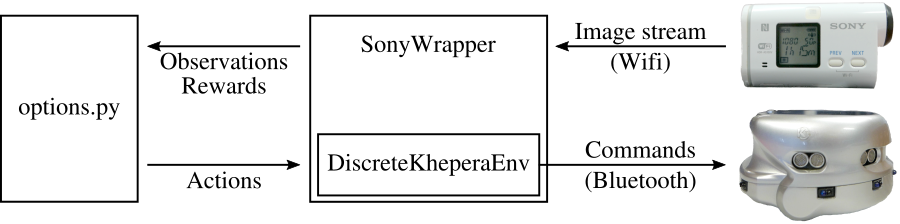
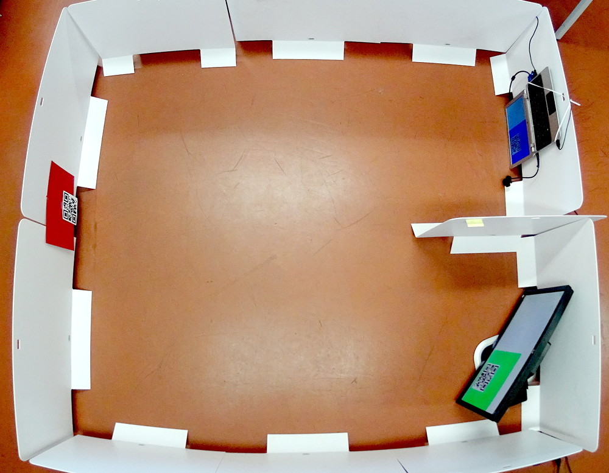

# Reinforcement Learning in POMDPs with Memoryless Options and Option-Observation Initiation Sets (OOIs)

The repository contains the complete implementation of the algorithm we propose in our AAAI 2018 paper on OOIs, raw results obtained on our machine, and scripts to re-run the experiments and re-plot them. This file details how to reproduce our results and provides information about how to use and extend our work. We hope that providing our implementation of Options with OOIs will increase their evaluation and adoption on new problems.

## Organization

The following components are available as supplementary material:

* The complete Python 3 source code of our algorithm;
* Four OpenAI Gym environments: TreeMaze, our modified DuplicatedInput, a simple simulator for our object gathering task (Terminals), and the infrastructure required to reproduce our robotic results;
* Option policies for TreeMaze and our object gathering task;
* Raw results and scripts to re-run all our experiments in a fully automated way.

In order to keep the size of this repository reasonable, the raw results only contain logs of runs 1 to 8, instead of all 20 runs. Missing files can be regenerated by re-running our experiments. The files are organized as follows:

* `gym_envs/`: Gym environments. This directory also contains a Gym environment wrapper that detects color blobs in images acquired using a wireless Sony camera.
* `hrl_with_next/options.py`: Our algorithm. This file implements Options with OOIs, using Policy Gradient on a feed-forward or LSTM neural network.
* `hrl_with_next/experiments.sh`: A script that re-runs all our experiments.
* `hrl_with_next/\*options`: Option policies for TreeMaze (14, 8 and 4 options) and our object gathering task (simulated or on a physical robot).
* `hrl_with_next/\*-results`: Raw results. These directories contain Gnuplot scripts that we use to generate our figures.

## Dependencies

Reproducing our results require a computer with the following components:

* A recent Linux distribution
* Python 3, with Keras, OpenAI Gym, OpenCV, zbar-py and pyserial
* GNU Parallel
* Gnuplot
* The Terminals GUI and our robotic task require PyQt5 to be installed

## Reproducing our Simulated Results

Our simulated results are reproduced by running `experiments.sh`. At the beginning of that script is some information about how to re-run specific experiments, instead of all of them. Single runs can be performed by executing `options.py`. This script takes a mandatory `--env` parameter, that defines the Gym environment to be used, and a large set of optional parameters, that configure the size and shape of the neural network, option sets and OOIs, learning rates, algorithmic details, batch sizes, etc. Our implementation is compatible with discrete-action Gym environments, that have either continuous or discrete observations.

## Reproducing our Robotic Results



Our robotic task relies on a [Khepera III robot](http://www.k-team.com/mobile-robotics-products/old-products/khepera-iii), a wireless Sony camera (any Sony-branded camera implementing the Sony Camera API works), and a computer having Wifi and Bluetooth connections. The figure above shows how the components communicate. The required hardware consists of a 1 QR-code printed on red paper, white walls, and two screens connected to the computer running the experiment. A picture below shows the setting used in our lab.

DiscreteKheperaEnv is a Gym environment that transmits actions to the Khepera robot. The actions are Forward, Left, Right and Stop, and are translated by DiscreteKheperaEnv to motor speeds, sent to the robot. A continuous-action version of this environment is also available, but was not used in our experiment. 

SonyWrapper wraps any Gym environment and produces observations based on images received from a Sony camera. This environment detects color blobs and QR-codes in the images, and provides as observation the (x, y, size) coordinates of three color blobs (the largest red, green and blue blobs), along with the one-hot encoding of the largest QR-code in the image. When a color is not present in the image, its coordinates are (0, 0, 0). When there is no QR-code, the one-hot vector is zeroed-out.

options.py is our implementation of Options with OOIs. It interacts with SonyWrapper as it would do with any other Gym environments. Due to the complex communication infrastructure required by our experiment, running our experiments requires the following steps to be followed:

* Power on the Sony camera and enable its Wifi connection (camera-dependent).
* Connect to the cameras's Wifi network on the computer that will run the experiment. gym_envs/sonywrapper.py may need to be adjusted if the camera has a different IP address than ours.
* Power on the Khepera robot, and pair with it (over Bluetooth) from the computer. Then, run `rfcomm bind hci0 <robot bluetooth address>` as root in order to create a serial link connected to the robot over Bluetooth. DiscreteKheperaEnv sets the desired speed of the motors by writing on that link. Make sure that `/dev/rfcomm0` is world-writable.
* Run the command given at the end of this list. This opens two windows, each containing one colored QR-code. Move the windows so that they do not overlap, possibly on two screens depending on your setup. Then, close the dialog that says that the experiment will start.
* The robot starts moving and performs the experiment. The QR-codes change according to the state of the terminals. By default, robot_policy.py follows our expert policy. If you want the robot to learn, replace line 172 (a comment) with `return None`. This will tell the agent to learn the top-level policy instead of following our expert one.

The robotic experiment is run using the following command:

```
python3 options.py \
    --env Khepera-v0 \
    --sony \
    --episodes 100000 \
    --avg 2 \
    --hidden 50 \
    --lr 0.001 \
    --policy robot_policy.py
```

Three arguments are particularly important. `--env Khepera-v0` defines the environment, and is mapped to DiscreteKheperaEnv. This environments sends commands to the Khepera robot and implements a backup policy that prevents the robot from hitting objects. `--sony` ensures that the Khepera environment is wrapped by SonyWrapper, so that features extracted from camera images are available to the reinforcement learning agent. Any environment can be wrapped by SonyWrapper. `--policy robot_policy.py` defines the policy used by the experiment. The policy file used in this experiment contains more than just policies. It defines the top-level and option policies (going towards color blobs until a QR-code is readable), manages the dynamic QR-code windows, and is also responsible for defining the task, by providing rewards to the agent.

Due to the high difficulty of using an actual Khepera robot, our results can also be reproduced using the Terminals gym environment. They are reproduced as part of our suite of simulated experiments. The Terminals environment simulates a robot moving between the terminals and the root in a single time-step, and produces simulated QR-code observations. Anything related to motors, vision and color blobs has been left out, as these features are only used for the actual robot to move towards colored objects. This means that, in Terminals, the agent does not observe the color of the current terminal, and has to remember to which terminal it decided to go at the root.


